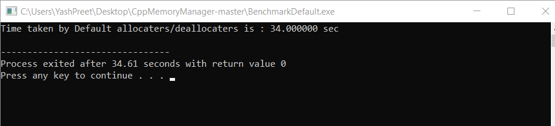
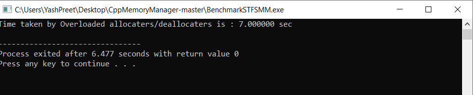

# CPP-Memory-Manager

This project is Single Threaded Fixed Size Memory Manager rather than Traditional new/delete.

Improved performance of new/delete operators.

# Time Taken With Default
 

 

# Time Taken With Modified

 

 
